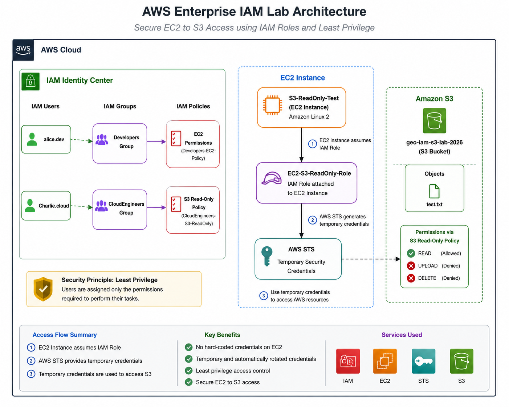

# AWS Enterprise IAM Lab Architecture

This directory contains the architecture diagram for the AWS Enterprise IAM Lab.

## Architecture Diagram

## Architecture Overview

This architecture demonstrates two IAM access patterns implemented in the project:

### IAM User Access

- `alice.dev` → Developers group → EC2 permissions
- `Charlie.cloud` → CloudEngineers group → S3 read-only permissions
- Permissions are assigned through IAM policies rather than unnecessary administrative access.

### EC2-to-S3 Role-Based Access

The EC2 instance uses the following secure access flow:

EC2 Instance → `EC2-S3-ReadOnly-Role` → AWS STS Temporary Credentials → Amazon S3

The EC2 instance does not use hard-coded AWS access keys.

AWS STS provides temporary credentials based on the IAM role attached to the EC2 instance.

## S3 Access

The IAM role provides read access to:

`geo-iam-s3-lab-2026`

The lab successfully demonstrated:

- Listing the S3 bucket
- Listing objects
- Downloading `test.txt`
- Reading the downloaded object
- Blocking unauthorized write operations with `AccessDenied`

## Security Principles Demonstrated

- Principle of Least Privilege
- Role-based access
- Temporary AWS credentials
- IAM group-based permissions
- Separation of user and workload permissions
- No hard-coded credentials on EC2
- Explicit testing of allowed and denied operations

## AWS Services

- AWS IAM
- Amazon EC2
- Amazon S3
- AWS STS
- Amazon VPC
- Security Groups
- AWS CLI
